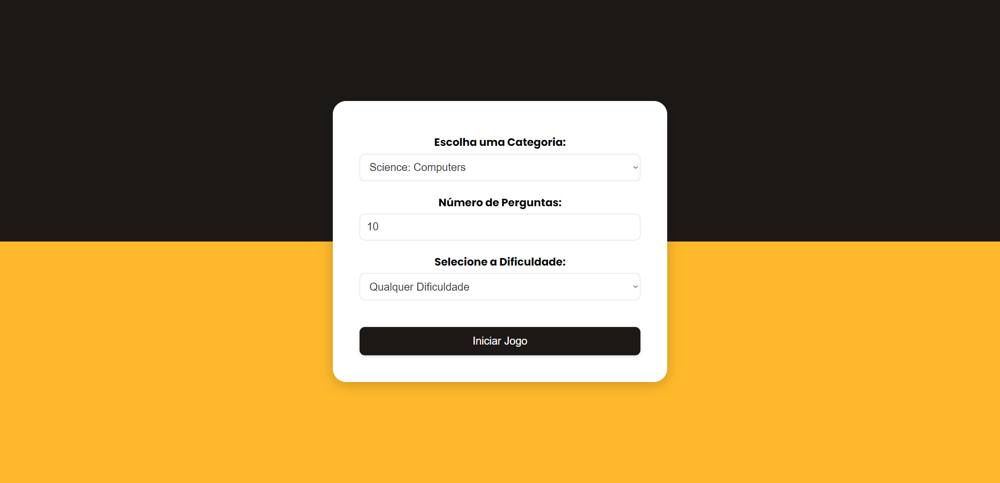
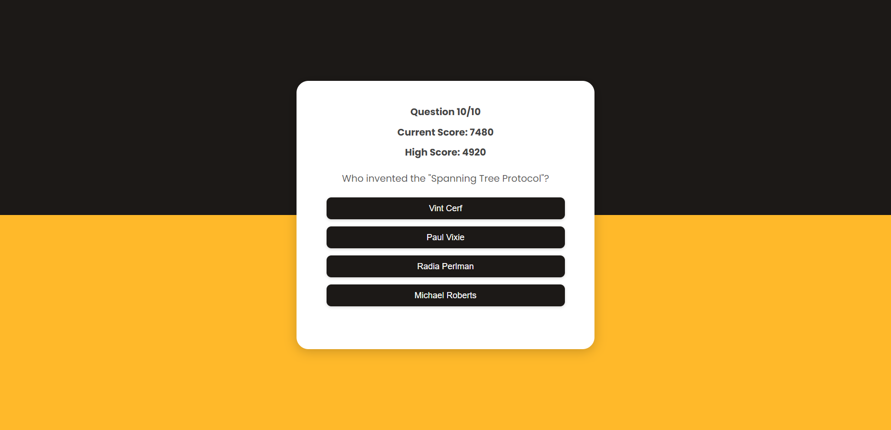

# Dia #61

### Jogo de Quiz com API
Neste tutorial ([Abrir no Youtube](https://youtu.be/so_FzCUMlf0)), monstra como programar um jogo de quiz com HTML, CSS e JavaScript! Este jogo obtém perguntas e respostas de uma API, e você não precisa adicionar manualmente as perguntas a ele! Você também pode escolher a dificuldade, categoria e o número de perguntas. Além disso, ele adiciona pontos à sua pontuação dependendo do tempo que você respondeu à pergunta 

